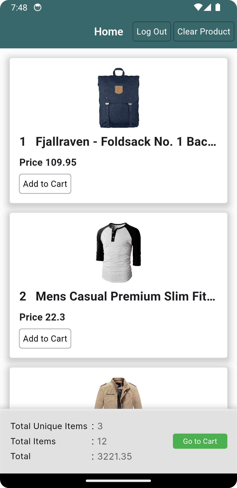
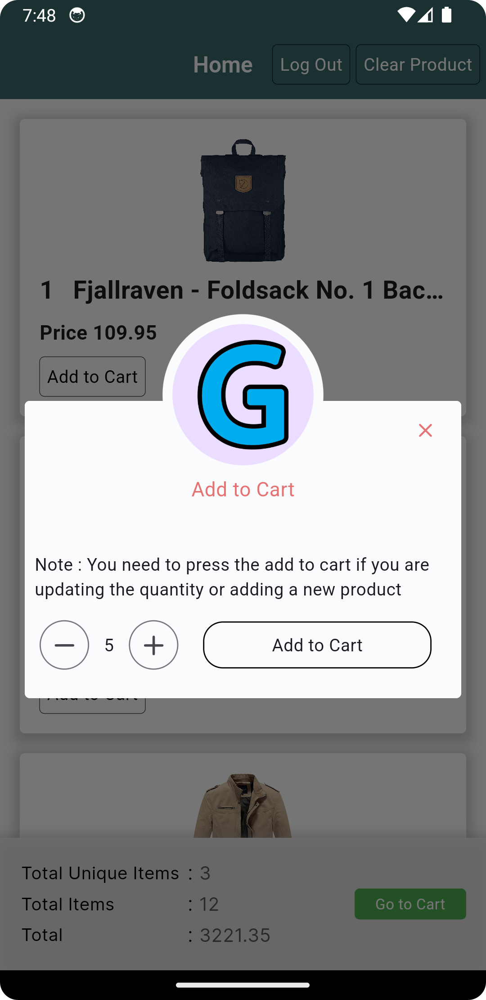
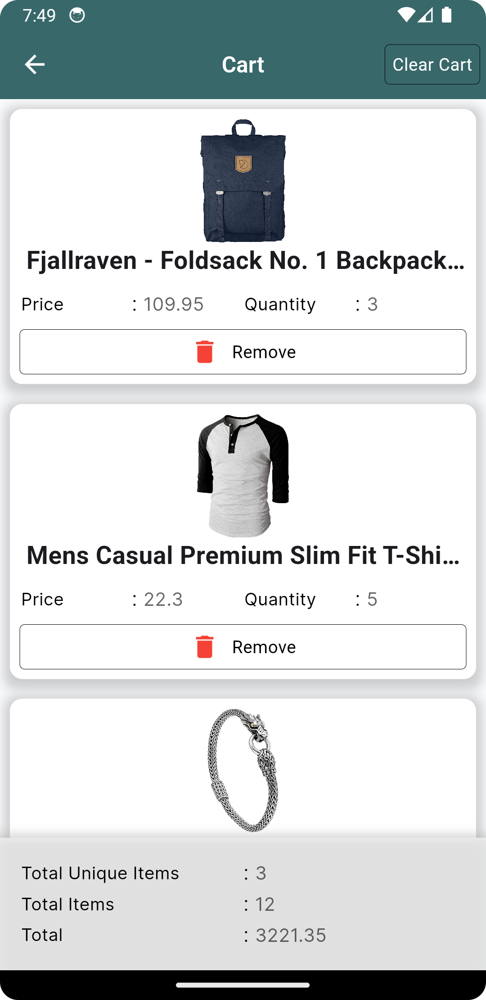
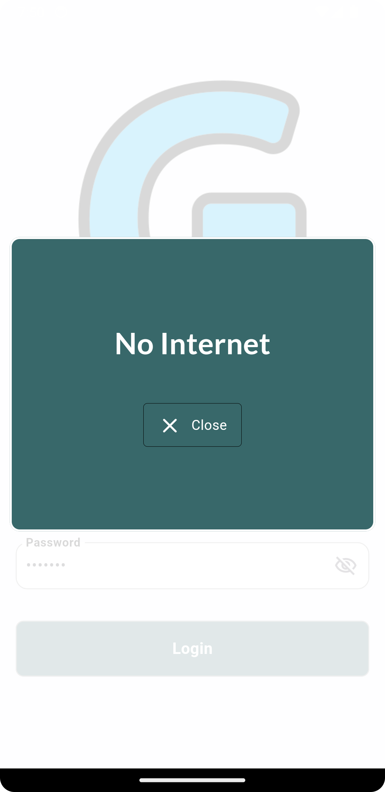

# Ghapfy Flutter Developer Hiring Test

## Overview
This Flutter project is part of the hiring process for Ghapfy. The goal of the project is to create a app for e-commerce app with the following features.

Modules:
- Sign In
- Product List page 
- Cart List page

Functionalities:
- User can sign in with email and password
- User can see the list of products with offline support
- User can add products to cart offline and online both
- User can see the list of products in cart offline and online both
- User can remove products from cart offline and online both
- User can see the total price of the products in cart offline and online both
- User can see the total number of products in cart offline and online both
- centralized error handling
- centralized loading handling
- centralized empty view handling
- centralized no internet connection handling
- centralized api call handling
- centralized api response handling
- centralized api error handling
- isolate data parsing
- centralized data parsing
- centralized data caching (Cart controller)
- centralized error logger on api call
- offline data storage with sqflite

## How to run the project
simply clone the project and run "flutter pub get" in the terminal on the root project directory
then run the project from the terminal by running the command "flutter run  lib/main_dev.dart or flutter run  lib/main_prod.dart"

## Login Credentials
- Email: johnd
- Password: m38rmF$

# Tested on Android (Simulator)

# State Management
This project uses **GetX** for state management. The relevant files are located in the `lib/app/core/base` directory:

# Project Structure
- **app**: Contains the main app 
- **app/core**: Contains the core functionality of the app.
- **app/core/base**: Contains the base classes for the app.
- **app/core/core_model**: Contains the core models for the app.
- **app/core/db_helper**: Contains the database helper class for the app.
- **app/core/session_manger**: Contains the session manager class for the app.
- **app/core/utils**: Contains the utility classes for the app.
- **app/core/values**: Contains the values classes for the app.
- **app/core/widget**: Contains the core widget classes for the app.
- **app/exporter**: Contains the central export file for the app.
- **app/routes**: Contains the routes for the app.
- **app/pages**: Contains the pages for the app.
- **app/services**: Contains the services for the app with api calls.
- **app/entity**: Contains the entities for the app.
- **app/bindings**: Contains the GetX bindings for the app.

## Libraries Used

- **[get](https://pub.dev/packages/get)**: State management library for Flutter with a focus on simplicity and performance.
- **[nb_utils](https://pub.dev/packages/nb_utils)**: A package for common utility methods and widgets.
- **[dio](https://pub.dev/packages/dio)**: A powerful Http client for Dart, which supports Interceptors, Global configuration, FormData, Request Cancellation, File downloading, Timeout etc.

# Screenshots

# Thank you

